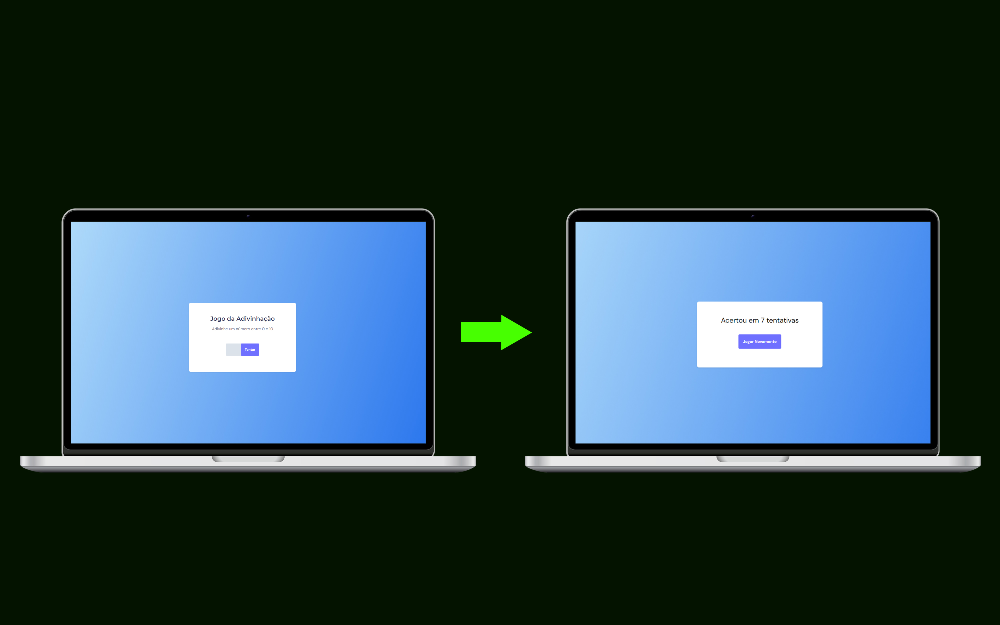

<h1 align="center">Jogo de Adivinhação</h1>

  

  

## 💻 Projeto

Aplicação Web com objetivo de estudos em javascript com a manipulação de elementos com a DOM

- [Acesse o projeto](https://gerador-descricao.vercel.app/)

## 🚀 Tecnologias

Esse projeto foi desenvolvido com as seguintes tecnologias:

- HTML e CSS
- Git e Github
- Vercel
- JavaScript
